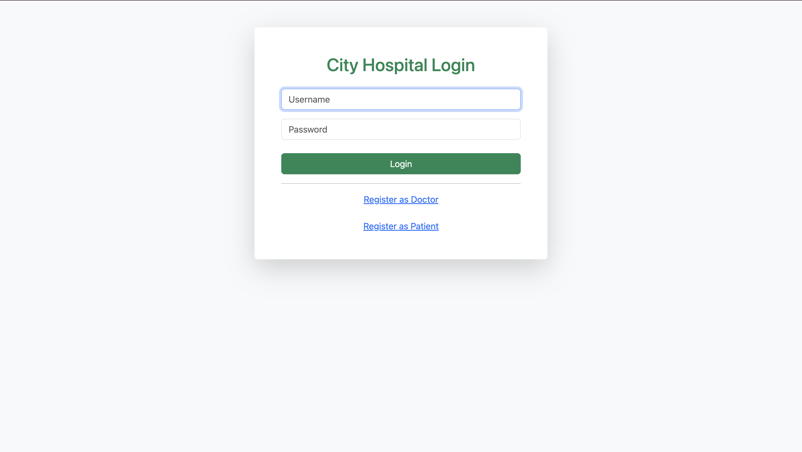
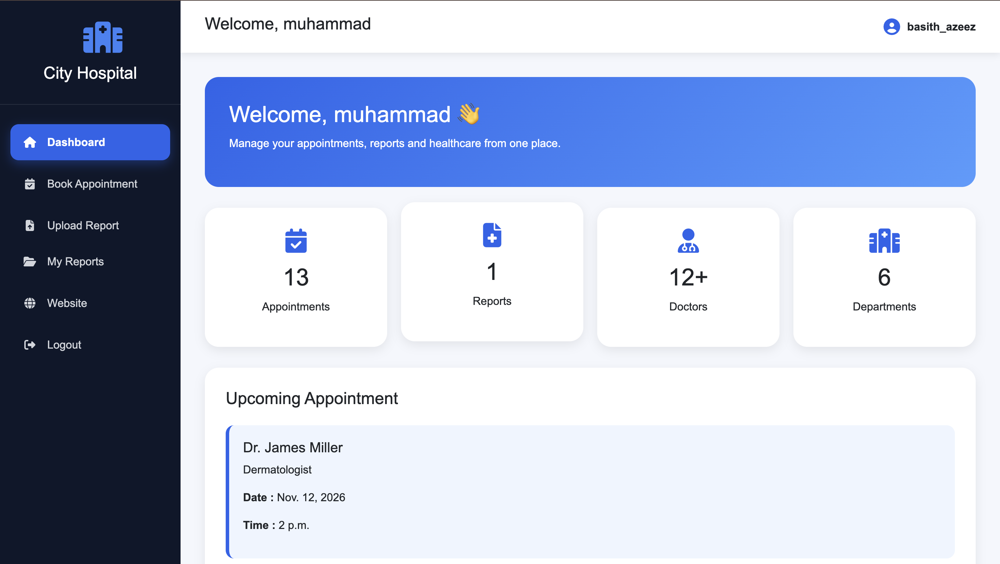
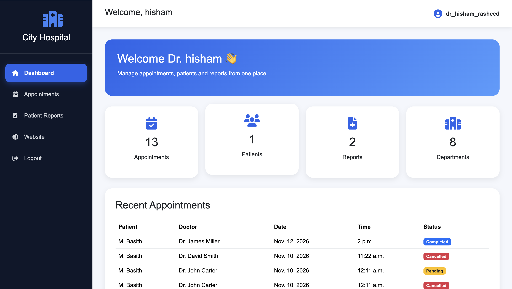
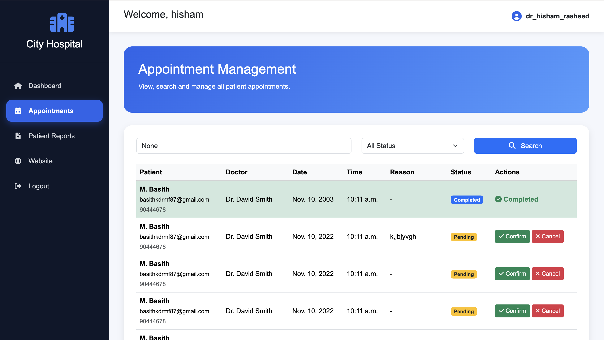
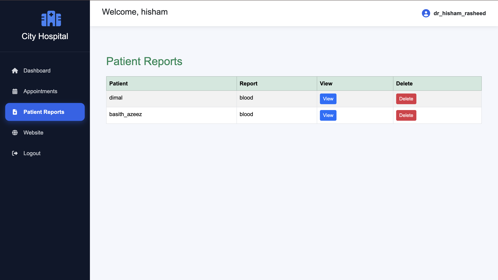
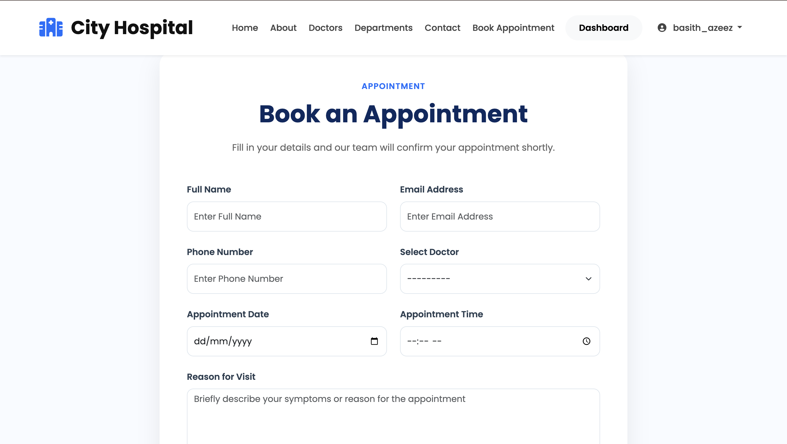

# 🏥 City Hospital Management System

A full-stack Hospital Management System built with **Django**, **Bootstrap 5**, and **PostgreSQL**. The application provides separate dashboards for doctors and patients, appointment booking, medical report management, authentication, and email notifications.

---

## 🌐 Live Demo

**Live Website**

https://city-hospital-management-system.onrender.com

---

## ✨ Features

### 👤 Patient

- Patient Registration & Login
- Book Appointments
- View Appointment Confirmation
- Upload Medical Reports (PDF)
- View Uploaded Reports
- Patient Dashboard
- Appointment History
- Report History

### 👨‍⚕️ Doctor

- Doctor Registration & Login
- Doctor Dashboard
- View All Patient Reports
- Delete Patient Reports
- Manage Appointments
- Update Appointment Status
  - Pending
  - Confirmed
  - Completed
  - Cancelled

### 📧 Email Notifications

- Email sent to Hospital Admin after booking
- Appointment confirmation email sent to patient

### 🔒 Authentication

- Custom User Model
- Role-based Login
- Patient Authorization
- Doctor Authorization

---

# 🚀 Tech Stack

| Technology | Used |
|------------|------|
| Python | ✅ |
| Django | ✅ |
| PostgreSQL | ✅ |
| HTML5 | ✅ |
| CSS3 | ✅ |
| Bootstrap 5 | ✅ |
| JavaScript | ✅ |
| Crispy Forms | ✅ |
| WhiteNoise | ✅ |
| Gunicorn | ✅ |
| Render | ✅ |

---

# 📸 Project Screenshots

## 🏠 Login Page



---

## 👤 Patient Dashboard



---

## 👨‍⚕️ Doctor Dashboard



---

## 📅 Appointment Management



---

## 📄 Medical Reports



---

## 📝 Booking Page



---

# 📂 Project Structure

```
city-hospital-management-system/

├── myproject/
├── student/
├── static/
├── templates/
├── uploads/
├── screenshots/
├── manage.py
├── requirements.txt
├── build.sh
├── README.md
└── data.json
```

---

# ⚙️ Installation

### Clone Repository

```bash
git clone https://github.com/basith670/city-hospital-management-system.git
```

### Navigate to Project

```bash
cd city-hospital-management-system
```

### Create Virtual Environment

#### Windows

```bash
python -m venv env
env\Scripts\activate
```

#### macOS/Linux

```bash
python3 -m venv env
source env/bin/activate
```

### Install Dependencies

```bash
pip install -r requirements.txt
```

### Apply Migrations

```bash
python manage.py migrate
```

### Load Sample Data

```bash
python manage.py loaddata data.json
```

### Run Server

```bash
python manage.py runserver
```

Open

```
http://127.0.0.1:8000/
```

---

# 👨‍⚕️ Doctor Module

- Doctor Registration
- Doctor Login
- Dashboard
- Appointment Management
- Patient Reports
- Delete Reports
- Appointment Status Update

---

# 👤 Patient Module

- Patient Registration
- Patient Login
- Dashboard
- Book Appointment
- Upload Reports
- View Report History

---

# 📋 Appointment Workflow

```
Patient Login
      ↓
Book Appointment
      ↓
Appointment Saved
      ↓
Email Notification
      ↓
Doctor Dashboard
      ↓
Manage Appointment
      ↓
Status Updated
```

---

# 📁 Medical Report Workflow

```
Patient Uploads PDF
       ↓
File Stored Securely
       ↓
Patient Dashboard
       ↓
Doctor Views Reports
       ↓
Doctor Can Delete Report
```

---

# 🔒 Security Features

- Django Authentication
- CSRF Protection
- Login Required Decorators
- Role-based Authorization
- Secure Password Hashing
- Protected File Access

---

# 📌 Future Improvements

- Prescription Module
- Doctor Profile Management
- Search & Filter Reports
- Patient Profile Editing
- SMS Notifications
- Online Payments
- Video Consultation
- REST API
- React Frontend
- Docker Deployment

---

# 👨‍💻 Author

**Muhammad Basith K**

- GitHub: https://github.com/basith670
- LinkedIn: *(Add your LinkedIn profile link here)*

---

# ⭐ If you like this project

Give this repository a ⭐ on GitHub if you found it useful.